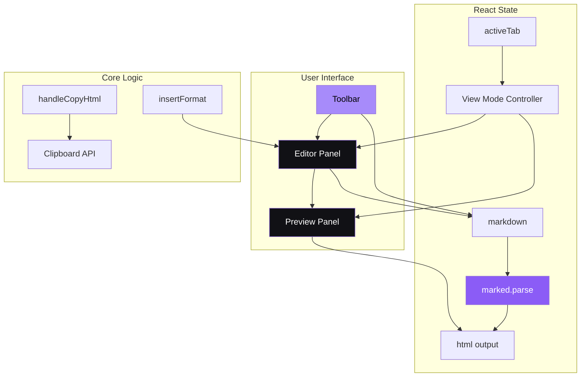
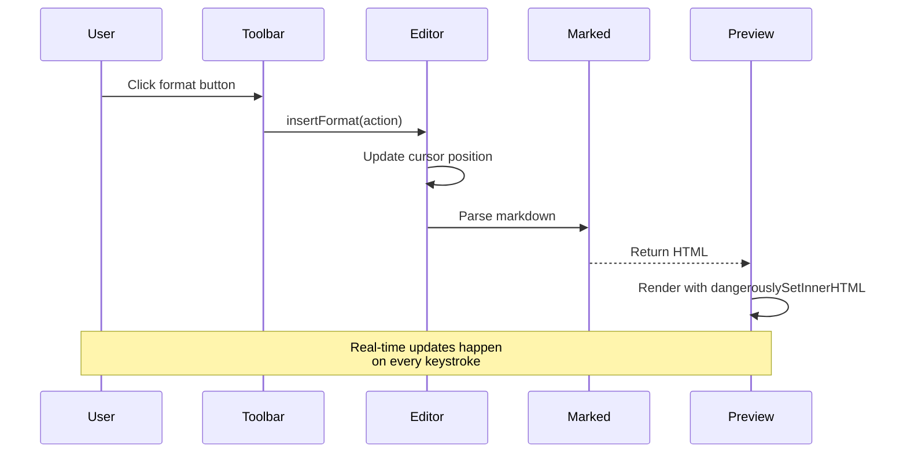

# Markdown Preview

> A modern, real-time markdown editor with live preview, toolbar shortcuts, and clean export functionality.

A powerful yet simple markdown editor that lets you write in raw markdown on the left panel and see the rendered HTML output in real-time on the right. Built with performance and developer experience in mind.

---

## ✨ Features

- **Real-time Preview** — See your changes instantly as you type
- **Toolbar Shortcuts** — Quick formatting buttons for headings, bold, italic, code, links, and more
- **Multiple View Modes** — Split view, editor-only, or preview-only
- **Live Statistics** — Character, word, and line counts update live
- **Export Ready** — Copy rendered HTML to clipboard with one click
- **Dark Mode UI** — Sleek dark theme with purple accents

---

## 🛠️ Tech Stack

| Category | Technology |
|----------|------------|
| **Framework** |  React 18 |
| **Build Tool** |  Vite |
| **Markdown** |  Marked |
| **Styling** | Pure CSS with CSS Variables |
| **Fonts** | Inter (UI), SF Mono / JetBrains Mono (Code) |

---

## 🏗️ Architecture





---

## ⚙️ How It Works

### 1. Markdown Parsing
The editor uses `marked` library to convert markdown text to HTML in real-time. The parsing happens inside a `useMemo` hook for performance optimization — it only re-parses when the markdown content changes.

### 2. Toolbar Actions
Clicking a toolbar button triggers the `insertFormat` function which:
- Gets the current text selection from the textarea
- Wraps or prefixes the selected text with the appropriate markdown syntax
- Places the cursor in the optimal position after insertion

### 3. View Modes
The app supports three view modes controlled by `activeTab` state:
- **`split`** — Shows both editor and preview panels side-by-side (50/50 grid)
- **`edit`** — Editor panel only, full-width
- **`preview`** — Preview panel only, full-width

### 4. Clipboard Export
The "Copy HTML" button uses the Clipboard API to copy the rendered HTML directly to the user's clipboard, with visual feedback via the `copied` state.

---

## 🚀 Getting Started

### Prerequisites

- Node.js 18+ 
- npm or yarn

### Installation

```bash
# Clone the repository
git clone https://github.com/NipunKachwaha/markdown-preview.git

# Navigate to project directory
cd markdown-preview

# Install dependencies
npm install
```

### Running Locally

```bash
# Start development server
npm run dev
```

Open [http://localhost:5173](http://localhost:5173) in your browser.

### Building for Production

```bash
# Create optimized build
npm run build
```

---

## 📁 Folder Structure

```
markdown-preview/
├── public/
│   └── favicon.svg           # App favicon
├── src/
│   ├── App.jsx               # Main React component
│   ├── main.jsx              # React entry point
│   └── styles.css            # All app styles
├── index.html                # HTML entry
├── package.json              # Dependencies
├── vite.config.js            # Vite configuration
└── README.md                 # This file
```

---

## 🔮 Future Scope

- [ ] Add local storage persistence for markdown content
- [ ] Implement multiple theme options (light/dark/custom)
- [ ] Add syntax highlighting for code blocks
- [ ] Support image uploads and drag-and-drop
- [ ] Export to PDF functionality
- [ ] Mobile-responsive improvements

---

## 🤝 Contributing

Contributions are welcome! Please feel free to submit a Pull Request.

1. Fork the repository
2. Create your feature branch (`git checkout -b feature/amazing-feature`)
3. Commit your changes (`git commit -m 'Add some amazing feature'`)
4. Push to the branch (`git push origin feature/amazing-feature`)
5. Open a Pull Request

---

## 📄 License

This project is open source and available under the [MIT License](LICENSE).

---

## 👤 Author

**Nipun Kachwaha**
- [Portfolio](https://space3dportfolio.netlify.app)
- [GitHub](https://github.com/NipunKachwaha)
- [LinkedIn](https://www.linkedin.com/in/nipun-/)
- [Twitter](https://x.com/desireofrana)

---

<p align="center">
  Made with ❤️ by Nipun Kachwaha
</p>
